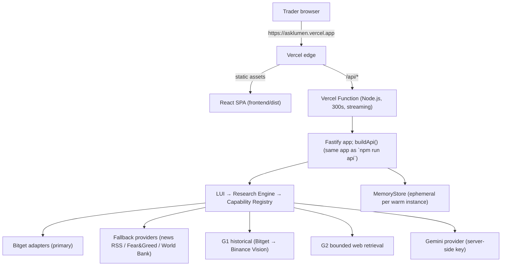

# Deployment

Status: **the full application deploys to Vercel**; frontend (static SPA) and backend
(serverless API functions) on one domain. This document describes the deployed
architecture honestly, including its real limitations.

Production URL: **https://asklumen.vercel.app/** (Vercel project: **lumen**, auto-deployed from `main` on GitHub)

---

## 1. Production architecture (deployed)



Key properties:

- **One application, two hosts.** `api/research.ts` is a ~40-line adapter that hosts the
  SAME Fastify app built by `buildApi()` (`src/api/server.ts`) inside Vercel's Node.js
  runtime via `app.routing()`. No research logic exists in the function file; there is no
  second backend.
- **Same-origin API.** The SPA calls relative `/api/...` in production
  (`resolveBaseUrl` returns `""` when `PROD`), so there is no cross-origin deployment and
  no CORS dependency in production. `VITE_API_URL` may still override the target
  (e.g. a locally running Fastify server during frontend development).
- **SSE streaming.** Research progress streams through the function's raw response —
  Vercel's Node.js runtime supports streaming responses. Function duration is configured
  to 300 s (`vercel.json`), comfortably above observed end-to-end research runs
  (~40–160 s live).

## 2. Configuration (Vercel project settings → Environment Variables)

| Variable | Scope | Purpose |
|---|---|---|
| `GEMINI_API_KEY` | production, preview | Gemini model access; **server-side only; never exposed to the browser** |
| `GEMINI_MODEL` | production, preview | Model override (free-tier-reliable Flash-class default) |
| `GROQ_API_KEY` | production, preview | Optional second model (typed fallback when Gemini fails technically: quota/outage/timeout). OpenAI-compatible; free tier |
| `GROQ_MODEL` | optional | Groq model override (`llama-3.3-70b-versatile` default) |
| `HEURIST_API_KEY` | production, preview | Optional Heurist Mesh agent/data-provider fallbacks (options chains, funding/OI, SEC filings, FRED macro). See `docs/integrations/heurist.md` |
| `WORKSPACE_FILE` | optional | Opt in to a `FileStore` at an explicit path. **Do not set it to a normal serverless disk path** (see §3) |

There are no `VITE_*` secrets and no credentials in the frontend bundle; the secret scan
(`grep` over `frontend/src` and the build output) is part of the release checklist.

## 3. Persistence; honest limits

**Production is durable Vercel Blob when the store is configured** (updated 2026-09-25).
`createProductionStore` in `api/research.ts` returns `VercelBlobStore` whenever
`BLOB_READ_WRITE_TOKEN` is present (it is, in this project), so research history survives
cold starts, refreshes and other instances. Without that token it falls back to
`WORKSPACE_FILE` (file) or an honest per-instance `MemoryStore` — serverless local disks
are ephemeral, so nothing is ever CLAIMED to be durable that is not.

**Blob store laws (Phase B, learned from a production incident):**

- **Reads bypass the CDN cache** — `get(..., { useCache: false })`. The SDK default is
  `true`, and a blob's default cache lifetime is a month, so a cached read could return a
  snapshot that predated another instance's write. Merge-before-write then merged the stale
  body and the write ERASED the other instance's completed runs (observed live: history
  shrank between reads; a finished run vanished). Never remove `useCache: false`.
- **Writes are conditional on the ETag they merged from** (`ifMatch`; `createOnly` for the
  first write). A precondition failure means another instance won the race: the store
  re-reads, re-merges and retries (bounded by `MAX_WRITE_ATTEMPTS`), never clobbers.
- **Writes carry `cacheControlMaxAge: 60`** — a mutable snapshot must not sit in a cache for
  the default month.
- **Every blob operation has a hard deadline** (`BLOB_IO_TIMEOUT_MS` = 20s, abort signal). A
  hung transport fails honestly instead of stalling the invocation until the platform kills
  it (which loses the finished run's record).
- **Failure semantics:** a failed save is reported (the POST fails with a typed persistence
  error), a missing blob is "no workspace yet", a corrupt snapshot is not a crash, and one
  failed save never poisons the store for later saves.
- **Records are one per completed run and are never evicted** (`ResearchResponseRecord`); a
  run's evidence/judgment objects live once in the graph and are rehydrated by ref on read.
  A run whose invocation died before its record landed is still listed and opens as an
  explicitly degraded `SUMMARY` (`recordTier` in `GET /api/research/:ref`) — never faked.

### Historical note (pre-Phase-B)

The production store used to be **per-instance memory**; this section described that limit
until 2026-09-25. The UI never claimed durable persistence and the health endpoint never
advertised any.

- **Local development** uses the real `FileStore` (`.data/workspace.json`); state
  survives restarts and restart-ID-collisions are handled (ID counters are re-seeded
  from the restored workspace).
- **Production (current)** is per-instance memory. Acceptable for a demo workload;
  runs are visible while the instance is warm.
- **Production (durable, when needed):** the `WorkspaceStore` interface is two methods
  (`save`/`load`), so the smallest real upgrade is a hosted key-value store (e.g. Vercel
  Blob / Upstash Redis) behind the same interface; a contained change in
  `src/persistence/`, no engine changes. This is deliberately NOT faked in the current
  deployment.

## 4. Local development

```bash
npm install            # backend deps
cd frontend && npm ci  # frontend deps
npm run api            # Fastify on :3001 (FileStore persistence)
cd frontend && npm run dev   # Vite on :5173 (proxies to localhost:3001 by default)
```

## 5. Deploying

```bash
npx vercel --prod --yes     # builds the SPA + API functions, promotes to production
```

The custom domain `asklumen.vercel.app` is attached to the `lumen` Vercel project and follows each production deployment from `main`.
Note: a manual `vercel alias set` does NOT follow future deployments automatically —
re-run it after a deployment if the domain drifts, or manage the domain in the project
settings so it always tracks production.

## 6. Known deployment limitations

1. **Ephemeral workspace state** (§3); by design, documented, not silently faked.
2. **300 s function ceiling**; research runs observed so far peak well below it; a
   pathologically slow provider could still hit it (the run would surface as an honest
   transport failure, never fabricated success).
3. **No background monitoring**; monitoring remains a persistent handoff record; the
   serverless model has no worker, and the product does not pretend to run one.

### Credential injection diagnostics

`/api/health` exposes `credentials.geminiKeyDefined` / `credentials.geminiKeyNonEmpty`
(presence booleans only, never values). If research returns MODEL_FAILURE (AUTH_FAILURE)
while the dashboard shows the variables configured, check these booleans first: a
deployment built before the variable had a value, or an empty value, produces exactly
this signature. Re-saving the variable and pushing a new deployment resolves it.
