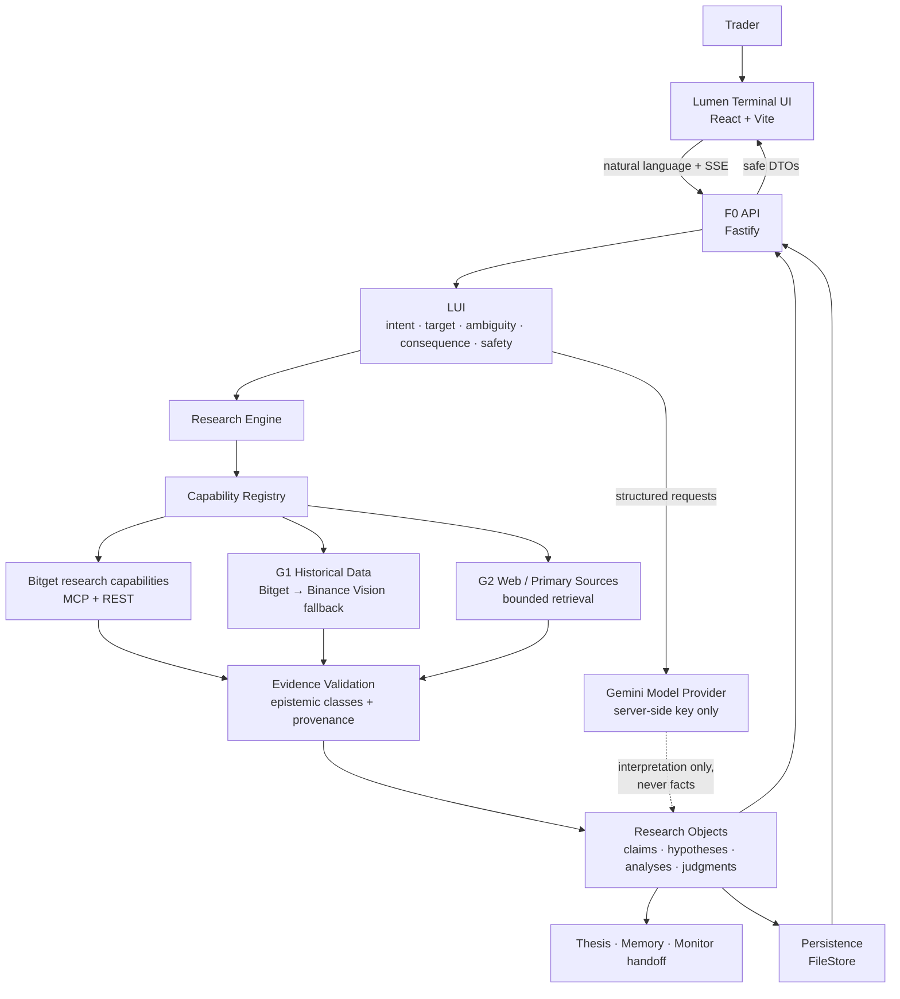
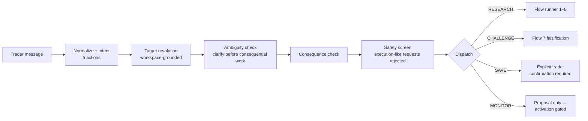
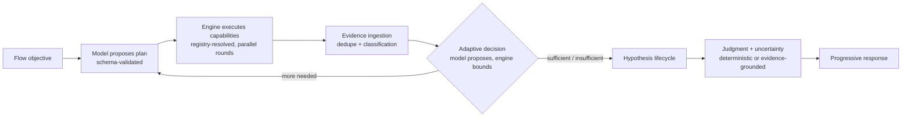
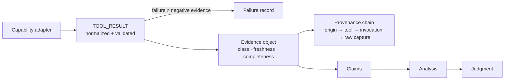
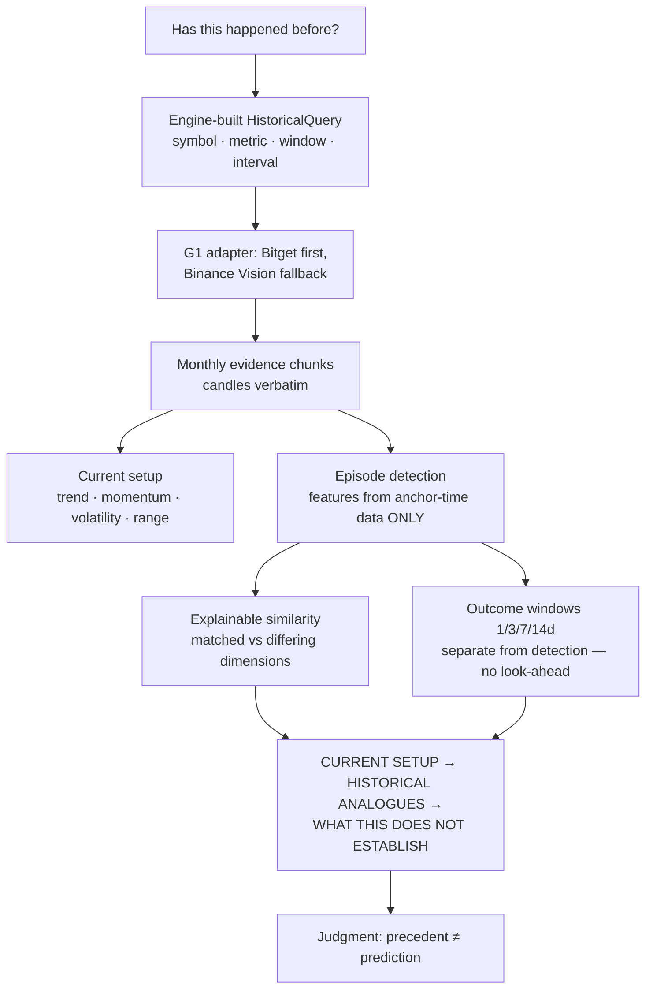
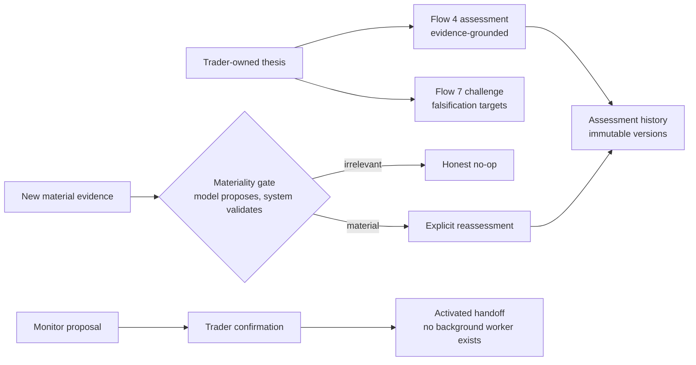

# Lumen Terminal

**An AI research workbench for traders** — ask a natural-language question about a market, and the system investigates it like a research analyst: it plans the research, retrieves real market evidence, classifies what it *observed* versus what it *interpreted*, preserves provenance for every claim, and reports its judgment **with** its uncertainty.

> **This is not a trading terminal.** Lumen Terminal performs research only. There are no orders, no execution, no position management, and no buy/sell signals anywhere in the system — by architecture, not by policy. *Research can inform a decision; research does not become the decision.*

Built for the Bitget AI Hackathon (Track 3).

---

## The problem

Traders ask questions like *"Why did BTC move today?"* or *"Has this setup happened before?"* and get one of two bad answers:

1. **A chatbot answer** — fluent text generated from a model's background knowledge, with no way to tell what was actually measured, what was inferred, and what is simply made up.
2. **A dashboard** — raw numbers with no synthesis, no contradiction handling, and no honest statement of what the data does not establish.

Both hide the most important thing: **the difference between an observation and an opinion.** Lumen Terminal is built to make that difference impossible to hide.

## What we built

- **Natural-language research intake** — a Gemini-interpreted LUI classifies every request into one of six actions (`RESEARCH`, `ANALYZE`, `CHALLENGE`, `MANAGE_STATE`, `MONITOR`, `SAVE`) and one of eight research flows. The model interprets; it never executes.
- **A research engine** — model-proposed, schema-validated research plans executed through a **capability registry** (no flow→tool hardcoding; the registry resolves providers, with fallback).
- **Real evidence with epistemic classes** — every piece of evidence is an `OBSERVATION`, `QUANTITATIVE_OBSERVATION`, `DERIVED_OBSERVATION`, `ANALYST_INTERPRETATION`, `INFERENCE`, `SPECULATION`, or `PROXY_EVIDENCE` — and unavailable data stays `UNAVAILABLE` (a failed fetch is never laundered into negative evidence).
- **Provenance on every object** — who/what created it, when, from which tool invocation, with raw-capture references for audit.
- **Historical precedent research (Flow 5)** — real multi-year candles, deterministic episode detection with **explainable** similarity (matched vs. differing dimensions — never a bare score), forward outcome windows, and **look-ahead protection** (episode features never use future data; outcomes are computed separately).
- **Thesis lifecycle** — trader-owned theses are assessed, challenged, and reassessed; they are never silently rewritten, and monitor activation always requires explicit confirmation.
- **Memory with decay** — saved knowledge is `CURRENT`, `STALE`, or `HISTORICAL`; current research always outranks stale memory.

## The 8 research flows

| # | Question | Status |
|---|---|---|
| 1 | **What happened?** | ✅ live-verified (real Bitget technical evidence) |
| 2 | **Why did it happen?** | ✅ deterministic |
| 3 | **What could affect it?** | ✅ deterministic |
| 4 | **Does my thesis hold?** | ✅ deterministic + API E2E |
| 5 | **Has this happened before?** | ✅ **live-verified** (1,095 real daily candles → episode analysis) |
| 6 | **What does all the information say?** | ✅ deterministic |
| 7 | **What could prove me wrong?** | ✅ deterministic |
| 8 | **Evaluate it by my framework** | ✅ deterministic |

A benchmark "pass" is the **correct epistemic outcome** — `COMPLETED`, `INSUFFICIENT_EVIDENCE`, `UNAVAILABLE`, or honest failure — never a forced success.

## Architecture



### LUI pipeline



### Research execution (per flow)



### Evidence & provenance



### Flow 5 historical analysis



### Thesis lifecycle



## The Gemini boundary

- Gemini **interprets** natural language, proposes research plans, and drafts synthesis — always schema-validated, always retry-bounded.
- Gemini **never** executes tools, never invents evidence, and its background knowledge is never presented as current market data. All market facts come from capabilities with provenance.
- The API key lives **server-side only** (`GEMINI_API_KEY`); the browser never sees it and never calls Gemini.
- Default model: `gemini-3.5-flash-lite` (selected by a live free-tier audit — see `.env.example`); configurable via `GEMINI_MODEL`.
- Model/provider failures surface as typed `MODEL_FAILURE` states — never silently retried into fabrication.

## Bitget, G1, and G2 capabilities

- **Bitget (M1/M2)** — MCP + REST transports with throttling, bounded retry, freshness, and `TOOL_RESULT` normalization. Live-verified: real technical-analysis evidence (RSI/MACD/Bollinger) with conflicting interpretations preserved as genuine disagreement.
- **G1 historical data** — engine-selected `HistoricalQuery` (symbol, metric, window, interval) served by **Bitget REST when reachable**, with **Binance Vision** (`data-api.binance.vision`, Binance's official keyless market-data mirror) as the live fallback; the serving venue is recorded in provenance. OHLCV is real and multi-year; funding/open-interest/liquidations are honestly `UNAVAILABLE` (mirrored nowhere reachable — never fabricated).
- **G2 web/primary sources** — bounded retrieval with URL validation (SSRF-safe), HTML-to-text extraction, source classification (**primary / secondary / commentary / community**), and source/evidence separation: a web page is a *source*, not automatically evidence. Repeated syndication of one origin is not counted as independent corroboration.

## Safety boundary

Structurally enforced, not prompt-enforced:

- No trading/execution capability exists in the registry, the API, or the frontend. Execution-like requests are rejected at the LUI safety screen (live-verified with adversarial phrasing).
- `SAVE` persists memory only through the explicit trader-confirmation boundary.
- Monitors are proposals; activation is confirmation-gated; **no background worker, cron, or notification infrastructure exists** — the UI labels monitor state as a handoff, not live surveillance.
- Source failure becomes `SOURCE_UNAVAILABLE`, never invalidation; retrieval failure never becomes negative evidence.
- The frontend renders backend **typed** epistemic state and never infers meaning from raw text.

## Benchmark proof

Verification categories are never collapsed (`VERIFIED LIVE` / `VERIFIED DETERMINISTICALLY` / `MOCKED` / `UNVERIFIED` / `BLOCKED-EXTERNAL`). Full details: [`BENCHMARK_REPORT.md`](BENCHMARK_REPORT.md), spec in [`BENCHMARK.md`](BENCHMARK.md).

| Layer | Result |
|---|---|
| Deterministic tests | **372 passed / 0 failed** (25 env-gated live tests skipped without credentials) |
| Backend typecheck | clean |
| Frontend typecheck + production build | clean |
| Live research (Suite B) | Flow 1 and Flow 5 COMPLETED with real evidence; Flow 5 live UI run verified |
| Browser E2E (Suite C / CDP) | real ask-bar submission → new backend research object → judgment (backend-side proof) |
| Security scans | no secrets, `.env` ignored, one fetch boundary in the frontend, no trading surface |

## Known limitations

- **News / sentiment / macro upstreams** are unreachable from some networks (Bitget endpoint blocking) — the system reports honest `INSUFFICIENT_EVIDENCE`/`UNAVAILABLE` rather than fabricating. Verified live where reachable.
- **G1 depth beyond OHLCV** — historical funding/OI/liquidations are not mirrored by any reachable source; reported `UNAVAILABLE`.
- **Monitoring is a handoff, not a worker** — proposed/activated monitors persist, but nothing runs in the background. This is intentional for this phase.
- **Single-process persistence** — `FileStore` (`.data/workspace.json`) is local and single-user; multi-user auth and external persistence are future work (see `DEPLOYMENT.md`).
- **Free-tier model quotas** — per-model daily limits on Gemini's free tier; quota exhaustion surfaces as an honest `MODEL_FAILURE`, and retries are bounded so it fails fast.

## Local setup

Requirements: Node.js ≥ 20, npm.

```bash
# 1. Install
npm install
cd frontend && npm install && cd ..

# 2. Configure (server-side only; never committed)
cp .env.example .env
#   → set GEMINI_API_KEY (GEMINI_MODEL defaults to gemini-3.5-flash-lite)

# 3. Run the backend API (port 3001)
npm run api

# 4. Run the frontend (port 5173)
cd frontend && npm run dev
```

Open **http://localhost:5173**, go to *Research*, and ask e.g.
`Search historical data for similar BTC setups and patterns.`

## Testing

```bash
npm test                # full deterministic suite (no API key needed)
npx tsc --noEmit        # backend typecheck
cd frontend && npm run build   # frontend typecheck + production build
```

Live tests are **env-gated** (`FREEBUFF_LIVE=1` + credentials) and never run in the deterministic suite. Browser E2E uses raw CDP against a real Chrome and asserts **backend-side** proof of submissions.

## Demo workflow

1. **What happened?** — `What is affecting BTC right now?` → Flow 1: current evidence, confidence, uncertainty.
2. **Has this happened before?** — `Search historical data for similar BTC setups and patterns.` → Flow 5: current setup → historical analogues (with matched/differing dimensions) → what the record does *not* establish.
3. **Does my thesis hold?** — save a thesis, then ask → Flow 4: evidence-grounded assessment, versioned history.
4. **What could prove me wrong?** — `What would prove my BTC thesis wrong?` → Flow 7: falsification targets, disconfirming evidence, monitor *proposals*.
5. **Watch the honesty paths** — submit an execution-like request (rejected), or exhaust the model quota (typed `MODEL_FAILURE`, no fabricated content).

## Project structure

```
├─ src/
│  ├─ domain/          # research objects, lifecycle, provenance, evidence laws
│  ├─ model/           # provider-neutral model layer (Gemini implementation, schemas)
│  ├─ lui/             # natural-language understanding + dispatch (6 actions)
│  ├─ research/        # flow runner, flows 1–8, episode analysis, context
│  ├─ adapters/        # capability registry, Bitget MCP/REST, G1 historical, G2 web
│  ├─ persistence/     # WorkspaceStore (file + memory)
│  └─ api/             # F0 boundary: Fastify server, routes, DTOs, SSE, error model
├─ frontend/           # React + Vite research workbench (single fetch boundary)
├─ tests/              # deterministic + env-gated live suites, benchmark suites A/B/C
├─ docs/architecture/  # the source-of-truth architecture documents
├─ AGENT.md            # operating laws for agents working in this repo
├─ API_CONTRACT.md     # frontend ↔ backend contract
└─ BENCHMARK.md / BENCHMARK_REPORT.md
```

Source-of-truth hierarchy: `docs/architecture/` → `AGENT.md` → `FINDINGS.md` → `handoff.md`.

## Deployment

See [`DEPLOYMENT.md`](DEPLOYMENT.md) — including an honest assessment of what Vercel can and cannot host for this architecture today.
