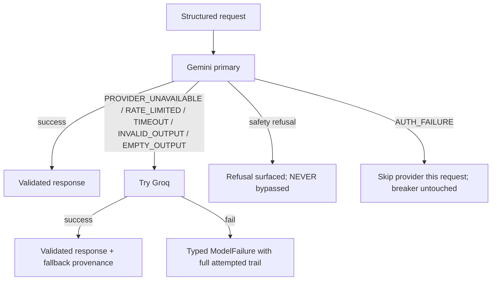

# Model Provider Fallback

How Lumen keeps research working when a model provider fails; typed, bounded, honest.

Verification labels follow BENCHMARK.md: **VERIFIED LIVE** (exercised against the real
provider), **VERIFIED DETERMINISTICALLY** (deterministic tests), **UNVERIFIED** (not yet
exercised with real credentials).

## 1. Providers

| Role | Provider | Interface | Model (default) | Status |
|---|---|---|---|---|
| Primary | Google Gemini (`src/model/gemini.ts`) | `ModelProvider` | `gemini-3.5-flash-lite` (via `GEMINI_MODEL`) | VERIFIED LIVE (production research runs) |
| Fallback | Groq (`src/model/groq.ts`) | `ModelProvider` | `llama-3.3-70b-versatile` (via `GROQ_MODEL`) | VERIFIED DETERMINISTICALLY; UNVERIFIED live until `GROQ_API_KEY` is configured |

Why Groq (researched 2026-09-18): OpenAI-compatible (`chat/completions` with
`response_format: json_object`), free tier with commercial use allowed, and an
**independent failure domain** from Google (a Gemini quota/outage cannot take Groq
down). Cerebras was rejected for proven catalog volatility (pruned a dozen models to
two without notice); Cohere's trial tier is non-commercial; staying within Gemini
alone offers no failure independence.

The second model's job is the model-fallback role only: LUI classification, context
resolution, target resolution, parameter extraction, research planning. It never
independently answers research questions, and it has no tool/workspace/evidence
authority (M3 §24: the model is the intelligence/interface layer, never the system
authority).

## 2. Fallback semantics (typed, never blind)

`ModelFallbackProvider` (`src/model/fallback.ts`) sits behind the same `ModelProvider`
interface; nothing above it changes.

- **Technical failures fail over**: `PROVIDER_UNAVAILABLE`, `RATE_LIMITED`, `TIMEOUT`,
  `INVALID_OUTPUT`, `EMPTY_OUTPUT` (non-safety), `UNKNOWN`. One attempt per provider
  per request; no cycling; no unbounded retries.
- **A genuine safety refusal is NEVER bypassed** (provider safety systems are not
  outages). Refusals are surfaced (`lastSafetyRefusal`) and thrown immediately.
- **AUTH failures** (missing credentials) skip that provider for the request without
  tripping the breaker: configuration is not an outage. Without `GROQ_API_KEY` the
  chain transparently runs Gemini-only.
- **Exhaustion rethrows the primary's typed failure** with the full attempted-model
  trail appended to the message (key-free by construction).

## 3. Validation parity

Both providers return raw text unvalidated; `validateModelOutput` (schemas.ts) remains
the single mandatory gate for every caller. The facade never self-certifies either
provider, and never repairs or rewrites malformed output.

## 4. Circuit breaker (lightweight health)

Per provider, in-process only: consecutive technical failures (threshold 3, default)
open a bounded cooldown (60s, default) during which the provider is SKIPPED, not
disabled. Cooldown elapses automatically; the next request retries it. One failure
never disables anything; success resets the counter. `health(providerId)` exposes
state/counters for diagnostics. No distributed state, no background processes.

## 5. Provenance and observability

- When fallback actually served, the response carries `fallbackProvenance`:
  `{ attemptedModels: [{providerId, modelId, failureType, failureReason}], selectedModel }`.
  Primary-only responses are untouched.
- `/api/health` reports credential PRESENCE booleans only (never values):
  `geminiKeyDefined/NonEmpty`, `groqKeyDefined/NonEmpty`, `heuristKeyDefined/NonEmpty`.
- Keys travel only in TLS-protected auth headers inside their provider adapters; they
  never appear in logs, errors, snapshots, provenance, or test output.

## 6. Environment

| Variable | Required | Purpose |
|---|---|---|
| `GEMINI_API_KEY` | yes (primary) | Gemini access; server-side only |
| `GROQ_API_KEY` | optional | Enables the fallback chain; absent = Gemini-only |
| `GROQ_MODEL` | optional | Groq model override |
| `HEURIST_API_KEY` | optional | Heurist Mesh data-provider fallbacks (separate concern; see docs/integrations/heurist.md) |

## 7. Test coverage (VERIFIED DETERMINISTICALLY)

`tests/model/model-fallback.test.ts` + `tests/model/provider.test.ts` (Gemini):
typed status mapping for both providers; safety-refusal non-bypass; AUTH skip without
breaker trip; bounded exhaustion with full trail; breaker open/recover/reset; provenance
injection only on real fallback; validation parity; key-free error messages.
